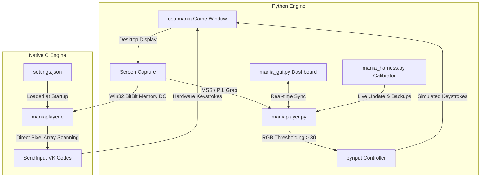

# ManiaPlayer V1.2.1

### CODED WITH ANTIGRAVITY, USER SUPPLIED BASE SCRIPT
A high-performance, ultra-low-latency computer vision automation bot and visual calibration harness for **osu!mania** (supporting 1K through 20K modes).

Designed with a dual-engine architecture: a modular **Python / MSS engine** for rapid tuning and visual dashboard control, paired with a compiled **Native Win32 C engine** for sub-millisecond execution and competitive play.

---

## 🌟 Overview & Key Highlights

- **Dual-Engine Execution**:
  - **Native C Engine (`maniaplayer.c`)**: High-performance Win32 GDI screen capture directly to raw memory buffers, high-precision timing via `QueryPerformanceCounter`, and direct `SendInput` hardware key dispatching. Capable of 1000+ FPS sampling loops.
  - **Python Engine (`maniaplayer.py`)**: Asynchronous, multi-threaded MSS / PIL desktop capture engine with live configuration syncing, hotkey integration, and real-time FPS reporting.
- **Modern Dark GUI Dashboard (`mania_gui.py`)**:
  - Live animated visualizer for all lanes with real-time note-hit indicators.
  - Performance monitoring and dynamic FPS counter (60 - 240+ FPS).
  - One-click launcher for the interactive visual calibrator (`🎯 Open Calibrator`).
  - Skin preset selector and instant start/stop controls.
  - Packaged as a standalone Windows executable (`maniaplayer.exe`).
- **Interactive Visual Calibration Harness (`mania_harness.py`)**:
  - **BBOX Drag & Resize**: Visually position the playfield capture box with 1px snap helpers and fine Y-offset shifting.
  - **Dynamic Multi-Key Support (1 to 20 Keys)**: Seamlessly switch between 4K, 7K, 8K, 10K, or custom key layouts with built-in presets (`QW[]`, `DFJK`, `ASKL`, `ZX./`, etc.).
  - **Auto-Spacing**: Automatically distribute lane trigger points evenly across any playfield width with a single click.
  - **Pixel Magnifier & Loupe**: Hover anywhere on the screenshot to inspect coordinates, exact RGB values, and brightness levels in real time.
  - **Live Judgement Detection Preview**: Visual strip showing simulated note detection (`sum(RGB)/3 > threshold`) at the judgement line before entering a match.
  - **Non-Intrusive Disappearing Capture**: Captures screenshots instantly or with a countdown delay, automatically hiding the calibrator window during capture so osu!mania is never occluded.
  - **Dedicated Backups Manager**: Every calibration save automatically archives a timestamped copy of `maniaplayer.py` into a dedicated `backups/` directory, preventing accidental loss of working configurations.
  - **Live Synchronization**: Saving or applying settings in the calibrator immediately propagates updates to both the running player engine and disk configurations (`mania_config.json`, `settings.json`).
  - **Always on Top**: Harness can float above osu!mania in fullscreen windowed / borderless modes.

---

## 📁 Repository & File Structure

```text
ManiaPlayerV1.0/
├── backups/                    # Automated timestamped backups of calibration and target files
├── presets/                    # Namable JSON presets for skins, keybinds, and resolutions
│   ├── WhiteCat_23_Speed.json
│   ├── WhiteCat_23_Speed_ASKL.json
│   └── WhiteCat_23_Speed_DFJK.json
├── build/                      # Build artifacts and compiler outputs
├── build.bat                   # GCC compiler script for the native C engine
├── run_gui.bat                 # Quick launcher for the GUI Dashboard
├── run_calibrator.bat          # Quick launcher for the Calibration Harness
├── run_player.bat              # Quick launcher for the standalone Python engine
├── mania_gui.py                # Modern Tkinter dark dashboard with lane indicators
├── mania_harness.py            # Visual calibration harness and coordinate tuner
├── maniaplayer.py              # High-speed Python automation engine (MSS / PIL)
├── maniaplayer.c               # Native Win32 C engine for ultra-low latency execution
├── maniaplayer_native.exe      # Compiled native Win32 C binary (via build.bat)
├── maniaplayer.exe             # Standalone GUI Dashboard executable
├── mania_config.json           # Active configuration for Python engine and GUI
├── settings.json               # Active configuration for native C engine
├── ManiaPlayer.spec            # PyInstaller build specification
├── Screenshot.png              # Calibration reference capture (PNG)
├── Screenshot.bmp              # Calibration reference capture (BMP for C engine)
└── README.md                   # Project documentation
```

### File Breakdown

| File / Folder | Role & Description |
|---|---|
| [`mania_gui.py`](file:///c:/Users/CHRISTOPHER/Documents/Python%20Projects/Computer%20Vision%20Projects/ManiaPlayerV1.0/mania_gui.py) | Full-featured Dark GUI dashboard with live note visualizers, FPS counters, engine toggles, and preset selection. |
| [`mania_harness.py`](file:///c:/Users/CHRISTOPHER/Documents/Python%20Projects/Computer%20Vision%20Projects/ManiaPlayerV1.0/mania_harness.py) | Visual calibration tool for fine-tuning BBOX, judgement line, lane positions (1-20 keys), and keybinds. |
| [`maniaplayer.py`](file:///c:/Users/CHRISTOPHER/Documents/Python%20Projects/Computer%20Vision%20Projects/ManiaPlayerV1.0/maniaplayer.py) | Python automation core utilizing MSS direct screen capture and `pynput` keyboard simulation. |
| [`maniaplayer.c`](file:///c:/Users/CHRISTOPHER/Documents/Python%20Projects/Computer%20Vision%20Projects/ManiaPlayerV1.0/maniaplayer.c) | High-performance native C source using Win32 GDI `BitBlt` and `SendInput` for minimum latency. |
| [`maniaplayer_native.exe`](file:///c:/Users/CHRISTOPHER/Documents/Python%20Projects/Computer%20Vision%20Projects/ManiaPlayerV1.0/maniaplayer_native.exe) | Compiled native Win32 C engine binary. |
| [`maniaplayer.exe`](file:///c:/Users/CHRISTOPHER/Documents/Python%20Projects/Computer%20Vision%20Projects/ManiaPlayerV1.0/maniaplayer.exe) | Compiled standalone GUI dashboard launcher. |
| [`backups/`](file:///c:/Users/CHRISTOPHER/Documents/Python%20Projects/Computer%20Vision%20Projects/ManiaPlayerV1.0/backups) | Dedicated folder storing timestamped safety backups created whenever calibrations are saved. |
| [`presets/`](file:///c:/Users/CHRISTOPHER/Documents/Python%20Projects/Computer%20Vision%20Projects/ManiaPlayerV1.0/presets) | Collection of preset configurations for different skins, scroll speeds, key counts, and layouts. |
| [`mania_config.json`](file:///c:/Users/CHRISTOPHER/Documents/Python%20Projects/Computer%20Vision%20Projects/ManiaPlayerV1.0/mania_config.json) | Central JSON configuration file for the Python application and GUI. |
| [`settings.json`](file:///c:/Users/CHRISTOPHER/Documents/Python%20Projects/Computer%20Vision%20Projects/ManiaPlayerV1.0/settings.json) | Configuration file read by `maniaplayer.c` containing lane coordinates and key mappings. |
| [`build.bat`](file:///c:/Users/CHRISTOPHER/Documents/Python%20Projects/Computer%20Vision%20Projects/ManiaPlayerV1.0/build.bat) | Batch script to compile `maniaplayer.c` with GCC optimization flags (`-O3 -march=native`). |
| [`run_gui.bat`](file:///c:/Users/CHRISTOPHER/Documents/Python%20Projects/Computer%20Vision%20Projects/ManiaPlayerV1.0/run_gui.bat) | One-click launcher for the Python GUI application. |
| [`run_calibrator.bat`](file:///c:/Users/CHRISTOPHER/Documents/Python%20Projects/Computer%20Vision%20Projects/ManiaPlayerV1.0/run_calibrator.bat) | One-click launcher for the Calibration Harness in standalone mode. |
| [`run_player.bat`](file:///c:/Users/CHRISTOPHER/Documents/Python%20Projects/Computer%20Vision%20Projects/ManiaPlayerV1.0/run_player.bat) | One-click launcher for the Python engine in console mode. |

---

## 🎮 Global Hotkeys

Global hotkeys operate in the background even when osu!mania is focused:

| Hotkey | Action | Description |
|:---:|---|---|
| **`F1`** | **Start Bot** | Begins real-time frame capture, note evaluation, and automatic keystroke inputs. |
| **`F2`** | **Stop / Pause** | Immediately halts note detection and releases all currently held keys. |
| **`F4`** | **Exit Application** | Safely releases all simulated inputs and terminates the player process. |

> **Note**: In `maniaplayer.py`, alternative hotkeys can also be configured (defaults: `f` = start, `s` = stop, `m` = menu, `/` = exit).

---

## 🛠️ Calibration Harness Deep Dive (`mania_harness.py`)

Calibration is the most crucial step for accurate note tracking. The harness provides an interactive graphical workspace to tune every parameter:

```text
+-----------------------------------------------------------------------------------+
|  [📸 Capture Now] [⏱️ In 2s] [📂 Load Image] [📌 Always on Top] [🔲 Box] [🎯 Lane] |
+---------------------------------------------------+-------------------------------+
|                                                   | Target: maniaplayer.py        |
|                                                   | [📁 Backups Folder]           |
|                                                   |-------------------------------|
|                                                   | Skin / Keybind Presets        |
|                                                   | [Dropdown] [📂 Load] [💾 Save]|
|               CANVAS WORKSPACE                    |-------------------------------|
|                                                   | Bounding Box (BBOX)           |
|    - Image Display (100% true screen DPI)         | Left / Top / Right / Bottom   |
|    - Interactive BBOX resize & drag handles       | [Snap 1px] [▲ Up] [▼ Down]    |
|    - Lane markers (L1, L2, L3, L4...)             |-------------------------------|
|    - Live Judgement Line overlay                  | Lanes & Keybinds (1-20 Keys)  |
|                                                   | Keys count: [4] [↔ Auto-Space]|
|                                                   | Key sets: [QW[]] [DFJK] [ASKL]|
|                                                   | Lane offsets & key entries    |
|                                                   |-------------------------------|
|                                                   | Live Detection Preview Strip  |
|                                                   | L1: 0  | L2: 255 | L3: 0 ...  |
|                                                   |-------------------------------|
|                                                   | Pixel Magnifier (Loupe 8x)    |
|                                                   | X: 940 | Y: 953 | RGB: (255..)|
+---------------------------------------------------+-------------------------------+
| Status: Ready. Zoom: 100%                         | X: 1102 | Y: 954 | RGB: (..)  |
+-----------------------------------------------------------------------------------+
```

### 1. Bounding Box (BBOX) Setup
- **Box Mode (`B`)**: Click and drag anywhere inside the bounding box to move it, or drag the edges/corner handles to resize.
- **1px Height Snap**: Shrinks the BBOX height to exactly 1 pixel for maximum frame capture speed and precise judgement line tracking.
- **Offset Y Shift**: Nudge the BBOX up or down by any number of pixels (`▲ Up`, `▼ Down`) to align perfectly with osu!'s hit line.

### 2. Multi-Key & Lane Positioning (1 to 20 Keys)
- Supports arbitrary key counts from **1 Key to 20 Keys** (e.g. 4K, 7K, 8K, 10K, etc.).
- **Auto-Space**: Evenly spaces all lane trigger points across the playfield width with mathematically balanced offsets.
- **Lane Mode (`L`)**: Click directly on the lane in the image to set the marker coordinate.
- **Keybind Assignment**: Set individual keybinds per lane or pick from quick presets (`QW[]`, `DFJK`, `ASKL`, `ZX./`, `SDF JKL`, `ASDF HJKL`, etc.).

### 3. Loupe / Pixel Magnifier & Live Detection Preview
- **Pixel Loupe**: Real-time 8x magnified view around your cursor showing exact pixel coordinates, RGB channels, and brightness calculation.
- **Detection Preview Strip**: Shows an instantaneous simulation of what the bot detects at the judgement line using the threshold `sum(RGB)/3 > 30`.

### 4. Automated Backups & File Integrity
- Saving updates via **💾 Save to maniaplayer.py** automatically:
  1. Creates a timestamped snapshot in the dedicated [`backups/`](file:///c:/Users/CHRISTOPHER/Documents/Python%20Projects/Computer%20Vision%20Projects/ManiaPlayerV1.0/backups) folder (`maniaplayer.py.bak_YYYYMMDD_HHMMSS`).
  2. Updates `BBOX`, `JUDGEMENENT_LINE`, `LANES`, and `KEYS` in `maniaplayer.py`.
  3. Synchronizes `mania_config.json` and `settings.json`.
  4. Pushes live updates into the running bot engine with zero restart needed.
- Click **📁 Backups Folder** in the harness sidebar to immediately inspect or restore previous revisions in Windows Explorer.

---

## ⚡ Dual Engine Architectures



### Python Engine vs. Native C Engine Comparison

| Characteristic | Python Engine (`maniaplayer.py`) | Native C Engine (`maniaplayer.c`) |
|---|---|---|
| **Capture Backend** | MSS / DirectX memory capture or PIL | Win32 GDI `BitBlt` into 32-bpp DIB Section |
| **Input Backend** | `pynput.keyboard` | Win32 `SendInput` with virtual keys |
| **Typical Polling Rate** | 120 - 240+ FPS | 500 - 1000+ FPS (QueryPerformanceCounter) |
| **Latency** | ~4 - 8 ms | < 1 ms |
| **Configuration** | `mania_config.json` + `maniaplayer.py` | `settings.json` |
| **Best Used For** | Calibration, testing, visualization, flexible scripting | Competitive maps, high BPM, extreme scroll speeds |

---

## 🚀 Getting Started

### 1. Requirements
- **Operating System**: Windows 10 or Windows 11 (64-bit recommended).
- **Python**: Python 3.10+ (tested with Python 3.14).
- **GCC / MinGW**: (Optional) Required only if compiling `maniaplayer.c`.

### 2. Python Dependencies
Install required packages via `pip`:
```powershell
pip install pillow mss pynput opencv-python
```

### 3. Step-by-Step Calibration & Play Guide

1. **Launch osu!mania**:
   - Set osu! to **Borderless** or **Windowed mode** matching your screen resolution.
   - Enter a map with your desired skin and scroll speed, then pause the game.
2. **Launch the Calibration Harness**:
   - Run `run_calibrator.bat` (or click `🎯 Open Calibrator` from `run_gui.bat`).
3. **Capture a Reference Frame**:
   - Click `⏱️ In 2s (Switch Window)` and quickly alt-tab to osu!mania.
   - The harness will hide itself, grab the screen, and reopen with your screenshot loaded.
4. **Calibrate the Playfield**:
   - In **Box Mode (`B`)**, drag the bounding box so it spans the width of your 4 (or N) lanes at the judgement line.
   - Click `Snap 1px Height` to optimize capture speed.
   - Adjust `Offset Y` to position the line precisely where notes are judged (300g/Rainbow 300).
5. **Adjust Lanes & Keybinds**:
   - Click `↔ Auto-Space` to distribute lane trigger points evenly.
   - Confirm keybinds match your osu!mania configuration (e.g. `QW[]`, `DFJK`, `ASKL`).
   - Check the **Live Detection Preview** strip to confirm notes trigger properly when notes pass the line.
6. **Save Configuration**:
   - Click `💾 Save to maniaplayer.py`.
   - Your backup is saved to `backups/`, and configs are updated across all files.
7. **Play**:
   - Switch back to osu!mania.
   - Press **`F1`** to start note tracking, **`F2`** to pause/stop, and **`F4`** to exit.

---

## 🔨 Compiling Native C Engine

To recompile `maniaplayer.c` into `maniaplayer_native.exe`:
```powershell
.\build.bat
```
Or execute GCC directly:
```powershell
gcc -O3 -s -march=native -Wall -o maniaplayer_native.exe maniaplayer.c -lgdi32 -luser32
```

---

## 📦 Presets & Backups

### Presets (`presets/`)
Presets store skin-specific settings as JSON:
```json
{
  "preset_name": "WhiteCat Skin 23 Speed (Default QW[])",
  "bbox": [677, 953, 1225, 954],
  "judgement_line": 0,
  "global_threshold": 30,
  "lanes": [
    {"name": "Lane 1", "rel_x": 39, "key": "q", "threshold": 30},
    {"name": "Lane 2", "rel_x": 215, "key": "w", "threshold": 30},
    {"name": "Lane 3", "rel_x": 353, "key": "[", "threshold": 30},
    {"name": "Lane 4", "rel_x": 502, "key": "]", "threshold": 30}
  ]
}
```
You can switch presets on the fly in the GUI or Calibration Harness.

### Automatic Backups (`backups/`)
Whenever settings are saved from the harness:
- A timestamped backup is generated: `backups/maniaplayer.py.bak_YYYYMMDD_HHMMSS`.
- Backups can be restored at any time by renaming the backup file back to `maniaplayer.py`.

---

## ⚠️ Disclaimer & Fair Play Notice

This software is developed strictly for **educational, computer vision research, and offline testing purposes**.
- Do **NOT** use this software on official osu! servers or online leaderboards.
- Using automation tools during ranked multiplayer or submitted plays violates the osu! Terms of Service and will result in account restriction/banning.
- Use only in offline mode or on private development servers.

---

## 📜 License

Distributed under the MIT License. See `LICENSE` for details if applicable.
